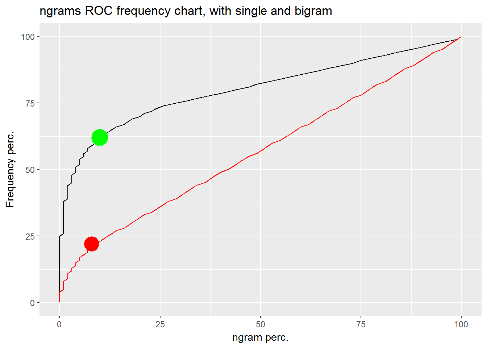

Text prediction using Ngrams, Product Presentation
========================================================
author: Steve de Peijper
date: 30-12-2016

Introduction
========================================================

This presentation shows the final text prediction product which was created during the Data Science Capstone project. The product was designed to be:

- Fast / responsive and require little storage
- Simple to use (on mobile device)

The next slides will explain;

- The approach
- Algorithm and fine tuning
- Results and recommendations

Approach
========================================================
left: 60%
- Load sample texts (news, blog and twitter).  
- Cleansing: to lower case, parse sentence and remove non regular characters.
- Create 5,4,3,2 and single grams. 
- Only load ngrams that cover 80% of total frequency (approx 30% of ngrams), see illustration. 
- Implement algorithm for tuning and unseen ngrams (next slide).
- Used AWS Cloud server (Rstudio AMI) with parallel computing. 

***

Algorithm
========================================================
<small>
Basic principle; f.e. 2 words are entered. These 2 words are used as input to a 3 gram. The 3rd word with the highest likelihood is presented. Same principle applies for 3 and 4 words.

Katz Back-off Model was used to deal with unseen ngrams. When f.e. no 5gram was found, an attempt will be made with a 4 gram, etc. Finally the word 'the' will be presented if all else fails. 

Additionally, Interpolation by Jelinek and Mercer (1980) was used. This method uses the probability of a lower ngram when determining the probability. The probability of the lower ngram is given a weight (lambda). 

Surprisingly the interpolation method did not increase accuracy! Accuracy improved a bit when giving a 4gram a bit more weight when using a 5gram. 
Many values were evaluated by incrementally adding more weight to the lower ngrams.
</small>

Results and recommendations
========================================================
<small>
The application can be viewed [here]. Please enter text (at least two words). And press submit. The most likely word is presented below. A table with the three most likely words is presented as well. 

Lessons learned:
- Use standard packages for performance. 
- Parallel computing with cloud server works well. 
- Interpolation adds little value (after initial testing)
- With only 50mb a large proportion of ngrams are available.

Recommendations:
  - ML to determine lamba values with interpolation.
  - Evaluate dynamic lamba values based on ngram frequency.
</small>

[here]: https://stevedep.shinyapps.io/textpredict/ "Text prediction app"
